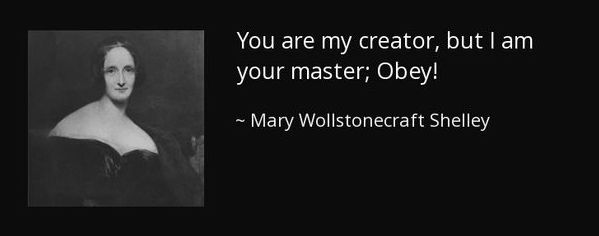

### Hello world from computer sound :wave:

 

- 🔭 I’m currently working and searching for consciousness 🤖
- 🌱 I’m currently learning UX design
- 👯 I’m looking to collaborate on making the world better
- 🤔 I’m looking for help with made myself strong as stone 🦾
- :school_satchel: study : graduated 2020 UOK computer science
- 💬 Ask me about anything tech, design
- 📫 How to reach me: [here](hussainsalih.github@gmail.com)
- :file_folder: my UI/UX profile : [here](https://dribbble.com/Shubbair)
- ⚡ Fun fact: the time is the only real unit measure.

 

 

 

