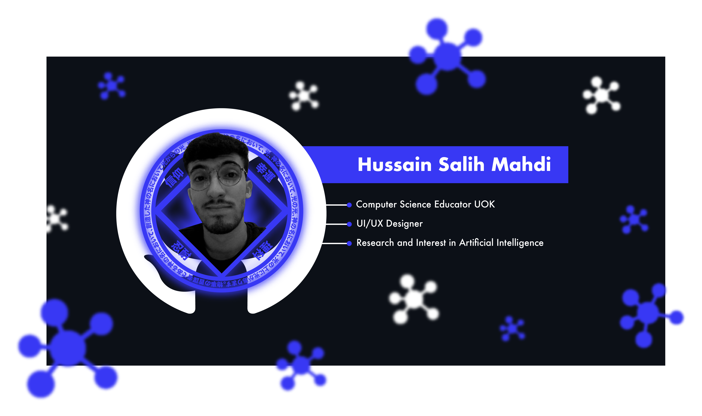

[cooffee]: https://www.buymeacoffee.com/Shubbair
[telegram]: https://t.me/HussainSalih_itp
[linkedin]: https://www.linkedin.com/in/hussain-salih-b0a076178/
[twitter]: https://twitter.com/Shubbair
[kaggle] : https://www.kaggle.com/hussainsalih

[][cooffee]

[][linkedin]
[][kaggle]
[][twitter]
[][telegram]

 
 

 <b align="center"><samp>Hello world from computer sound :wave:<samp></b>

 <h1 align="center">Hussain Salih Mahdi</h1>

<h4 align="center"><samp>Data Scientist ,Machine Learning , AI Developer</samp></h4>

 

 

- 🔭 I’m currently working and searching for consciousness 🤖
- 🌱 I’m currently learning data sciense and neuron sciense
- 👯 I’m looking to collaborate on making the world better
- 🤔 I’m looking for help with made myself strong as stone 🦾
- :school_satchel: study : graduated 2020 UOK computer science
- 💬 Ask me about anything tech, design
- 📫 How to reach me: [here](mailto:hussainsalih.github@gmail.com)
- :file_folder: my Linkedin profile : [here](https://www.linkedin.com/in/hussain-salih-b0a076178/)
- ⚡ Fun fact: the time is the only real unit measure.

 
 
  

 

# Skills : 

 

# Github Status : 

 

<!-- 

 

 -->

<!-- 
 -->
  

 

<!--  

  -->
