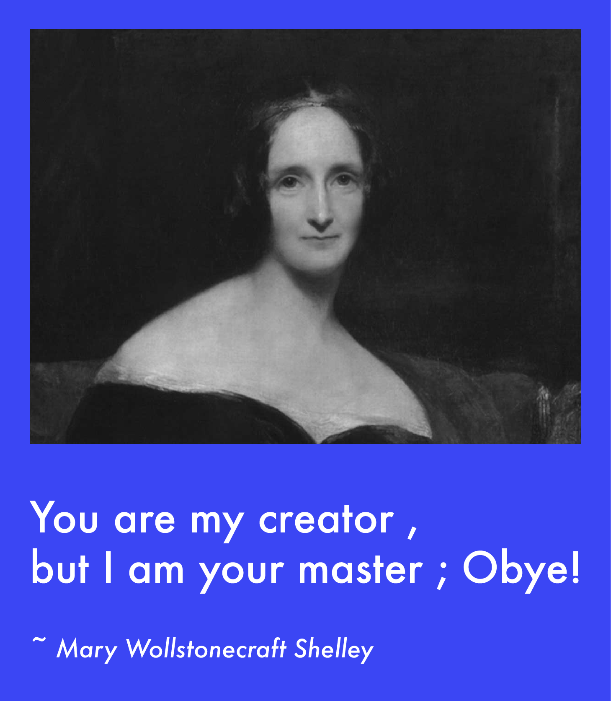
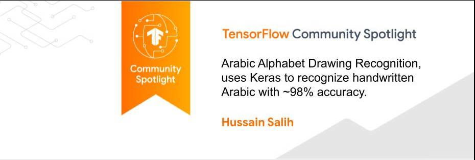
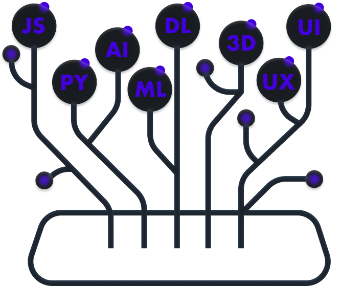
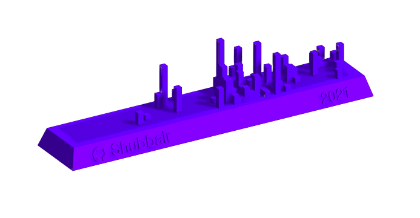

[cooffee]: https://www.buymeacoffee.com/Shubbair
[telegram]: https://t.me/HussainSalih_itp
[linkedin]: https://www.linkedin.com/in/hussain-salih-b0a076178/
[twitter]: https://twitter.com/Shubbair
[kaggle]: https://www.kaggle.com/hussainsalih

[][cooffee]

[][linkedin]
[][kaggle]
[][twitter]
[][telegram]

 
 

 <b align="center"><samp>Hello world from computer sound :wave:<samp></b>

 <h1 align="center">Hussain Salih Mahdi</h1>

<h4 align="center"><samp>Data Scientist , Machine Learning Enginner</samp></h4>

 

- 🔭 I’m currently working and searching for consciousness 🤖
- :school_satchel: study : graduated 2020 UOK computer science w/GPA 3.24  
- 📫 E-Mail : [here](mailto:hussainsalih.github@gmail.com)
- :file_folder: my Linkedin profile : [here](https://www.linkedin.com/in/hussain-salih-b0a076178/)
- ⚡ : The math are language created by brain to understand the world.

 
 
  

 

 

 

# Skills : 

 

# Github Status : 

 

