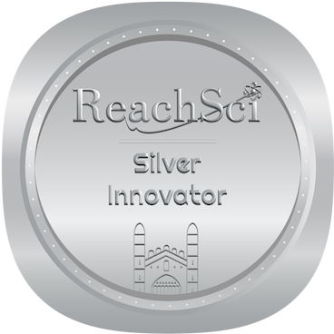

[][linkedin]
[][twitter]
[][telegram]

 

 

[telegram]: https://t.me/Shubbair8
[linkedin]: https://www.linkedin.com/in/hussain-salih-b0a076178/
[twitter]: https://twitter.com/Shubbair

 <h1 align="center">Hussain Salih</h1>

<h4 align="center"><samp>ML Enginner & Researcher</samp></h4>

 

- 🔭 love to search & work with AI models 🤖
- :school_satchel: study : graduated 2020 UOK computer science w/GPA 3.24 , 
- Now : Studing Master of Computer Science
- Talk : 2022,2023,2024 Give talks with Google Developer Student in collge about AI
- TedX : 2025 Speaks about AI Thinking & Reasoning
- ⚡ : The math are language created by brain to understand the world.

 
 
  

 

 

