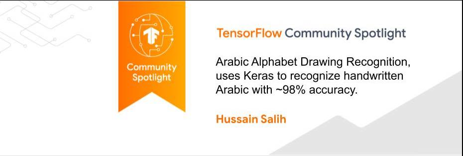
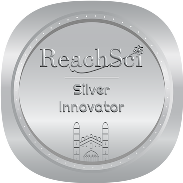

[][linkedin]

  

 

[telegram]: https://t.me/Shubbair8
[linkedin]: https://www.linkedin.com/in/hussain-salih-b0a076178/
[twitter]: https://twitter.com/Shubbair

 <h1 align="center">Hussain Salih</h1>

<h4 align="center"><samp>AI Research Engineer</samp></h4>

 

- 🔭 Research and Implements AI Models 🤖
- :school_satchel: study : Master of Computer Science
- Tech Talk : 2022,2023,2024 Give talks with Google Developer Student in collge about AI
- TEDx : 2025 Speaks "`Will AI ever wake up?`" [Youtube](https://youtu.be/tKC_KFTBomw?si=xLZV537qihxujCrI)

 

 

 

